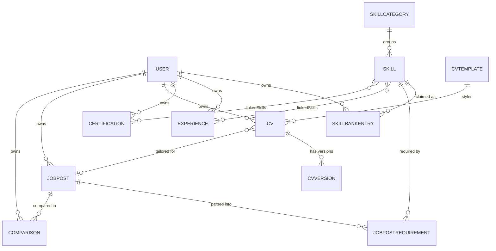

# DevPrep — Project Overview

> A SaaS that helps job-seeking developers quantify how their background matches a specific job post, generate tailored CVs, and close skill gaps — with a **deterministic** core pipeline and optional AI layered on top.

**Related docs:** [`architecture-notes.md`](./architecture-notes.md) — reasoning behind storage, versioning, and rendering decisions.

---

## 🎯 Problem (Core Idea)

Job-seeking developers apply to multiple roles without a concrete, low-cost way to see how their background actually matches each one:

- Generic prep and generic resume advice, not tied to the actual posting
- No quick way to see which skills are missing for a specific job
- Tailoring a CV per application is manual, slow, and inconsistent
- As a developer's career grows, skills, experience, and certifications pile up faster than they can be remembered or kept organized
- No feedback loop connecting *"what the job asks for"* to *"what I should fix"*

**DevPrep** lets a developer maintain a growing **skill bank** (skills, experience, certifications), generate **tailored CVs** from it per job post, and compare against as many job posts as they want to get a quantified **skill-gap list**, match advice, and in-app editing to close the gaps.

The core comparison pipeline is **deterministic** (structured data, not AI parsing) to keep it fast and cheap. AI is layered on top as optional, bounded features.

---

## 👥 Users

| Persona | Needs |
| --- | --- |
| 🔍 **Active Job Seeker** | Applying to multiple roles; wants to see fit per posting and prioritize which gaps matter most. |
| 🎓 **Career Switcher / Junior Dev** | Unsure if they meet a role's bar; needs a concrete list of what's missing and how to close it. |
| 😌 **Passive Candidate** | Wants to track fit across several postings before committing time to a full application. |

---

## ✨ Features

### A. 🏦 Skill Bank
- Persistent, structured store of a user's **skills, experience, and certifications**, added/edited over time via structured input — the single source of truth for everything else in DevPrep.
- **Fixed taxonomy**: skills belong to predefined categories (Languages, Frameworks, Tools, Soft Skills, Domain Knowledge), each with a closed list of entries — keeps gap matching exact and reliable.
- Can be **bootstrapped by importing an existing CV** (parsed once into skill bank entries) so users aren't starting from a blank form.

### B. 📄 CVs
- Generate **multiple CVs** from the skill bank, each tailored to a specific job post (pulls the most relevant entries based on that post's requirements).
- **3 templates × 2 variants** (no image / image placeholder) = **6 total layouts**.
- Templates are **parsable/structured** so the system can populate them from skill bank data and re-derive structured data back out if needed.
- CVs are **editable and versioned** over time.

### C. 📋 Job Posts
- Users add job posts by **pasting the job description text** (URL scraping is out of scope for MVP).
- Unlimited job posts (subject to plan limits).
- Stored with **structured requirement fields** (skills, seniority, tools) filled by the user or extracted via simple rule/keyword matching — **no LLM dependency in the core path**.

### D. 📊 Comparison & Gap Analysis
- The **skill bank** (not a single static CV) is compared against each job post, so gap analysis always reflects the user's full background.
- **Deterministic**: set-diff / weighted scoring between skill bank fields and job post requirement fields.
- Output per comparison: **fit score**, **gap list** (skill, required level, current level, severity), and **rule-based advice** on what to address first.

### E. ✏️ CV Editing
- In-app editor to update a generated CV's fields directly, or apply suggested field changes sourced from a comparison's gap list.
- **Accept/reject** suggested changes; each accepted edit creates a **new CV version**.
- Edits stay **local to that CV** (no auto-sync back to the Skill Bank). If an edit diverges from the Skill Bank, the changed line gets a yellow **"stale"** indicator with a tooltip explaining what changed and why — the user deliberately decides whether to update the Skill Bank. Stale warnings can be toggled off.

### F. 🤖 AI Features — *Pro only, optional add-ons (not part of the core pipeline)*
| Feature | What it does |
| --- | --- |
| **Bullet rewriter** | Improves a CV bullet against a specific job post's language |
| **Gap explainer** | Plain-language explanation of why a flagged gap matters |
| **Score narrative** | Turns the deterministic fit score into a short written summary |
| **Job post summarizer** | Condenses a long job post into key requirements |
| **Cover letter generator** | Drafts a cover letter from CV + job post |
| **Auto-tag job posts** | Categorizes job posts by role type / seniority |
| **Interview question generator** | Suggests likely questions per weak area (no scoring, no session state) |

---

## 🗄️ Data Model

> ⚠️ Rough mockup — **not set in stone**. See [`architecture-notes.md`](./architecture-notes.md) for the reasoning behind storage, versioning, and rendering decisions.

### Entity Relationship Diagram



### Prisma Schema (draft)

> **IMPORTANT:** Migrations only — **NEVER** `db push` or edit the DB structure directly. Run migrations in dev, then prod (same rule as DevStash).

```prisma
// ---- Enums ----
enum ProficiencyLevel {
  BEGINNER
  INTERMEDIATE
  ADVANCED
  EXPERT
}

enum TemplateVariant {
  NO_IMAGE
  IMAGE_PLACEHOLDER
}

// ---- Auth / Billing ----
// Extends the NextAuth v5 User (Account / Session / VerificationToken models omitted for brevity).
model User {
  id                   String  @id @default(cuid())
  email                String  @unique
  name                 String?
  image                String?

  // Billing
  isPro                Boolean @default(false)
  stripeCustomerId     String? @unique
  stripeSubscriptionId String? @unique

  // Relations
  skillBankEntries SkillBankEntry[]
  experiences      Experience[]
  certifications   Certification[]
  cvs              CV[]
  jobPosts         JobPost[]
  comparisons      Comparison[]

  createdAt DateTime @default(now())
  updatedAt DateTime @updatedAt
}

// ---- Fixed Taxonomy (system-seeded) ----
model SkillCategory {
  id     String  @id @default(cuid())
  name   String  @unique // Languages | Frameworks | Tools | Soft Skills | Domain Knowledge
  skills Skill[]
}

model Skill {
  id         String @id @default(cuid())
  name       String // e.g. "React", "Docker", "Communication"
  categoryId String
  category   SkillCategory @relation(fields: [categoryId], references: [id])

  bankEntries     SkillBankEntry[]
  jobRequirements JobPostRequirement[]
  experiences     Experience[]    @relation("ExperienceSkills")
  certifications  Certification[] @relation("CertificationSkills")

  @@unique([categoryId, name])
}

// ---- Skill Bank ----
model SkillBankEntry {
  id                String           @id @default(cuid())
  proficiencyLevel  ProficiencyLevel
  yearsOfExperience Int?

  userId  String
  user    User   @relation(fields: [userId], references: [id])
  skillId String
  skill   Skill  @relation(fields: [skillId], references: [id])

  createdAt DateTime @default(now())
  updatedAt DateTime @updatedAt

  @@unique([userId, skillId]) // one claim per skill per user
}

model Experience {
  id        String    @id @default(cuid())
  company   String
  title     String
  startDate DateTime
  endDate   DateTime? // null = current role
  bullets   String[]  // one or many accomplishment lines

  userId       String
  user         User    @relation(fields: [userId], references: [id])
  linkedSkills Skill[] @relation("ExperienceSkills")

  createdAt DateTime @default(now())
  updatedAt DateTime @updatedAt
}

model Certification {
  id            String    @id @default(cuid())
  name          String
  issuer        String
  issueDate     DateTime
  expiryDate    DateTime?
  credentialUrl String?

  userId       String
  user         User    @relation(fields: [userId], references: [id])
  linkedSkills Skill[] @relation("CertificationSkills")

  createdAt DateTime @default(now())
  updatedAt DateTime @updatedAt
}

// ---- CVs ----
model CVTemplate {
  id      String          @id @default(cuid())
  name    String          // "Minimal" | "Classic" | "Modern"
  variant TemplateVariant
  cvs     CV[]

  @@unique([name, variant]) // 3 names × 2 variants = 6 rows
}

model CV {
  id           String @id @default(cuid())
  title        String // user label, e.g. "Backend Dev - Acme App"
  draftContent Json   // live, mutable autosave working copy (not versioned itself)

  // Denormalized pointer to newest CVVersion for fast lookups
  latestVersionId String?

  userId     String
  user       User       @relation(fields: [userId], references: [id])
  templateId String
  template   CVTemplate @relation(fields: [templateId], references: [id])
  jobPostId  String?    // which post it was tailored for (optional)
  jobPost    JobPost?   @relation(fields: [jobPostId], references: [id])

  versions CVVersion[]

  createdAt DateTime @default(now())
  updatedAt DateTime @updatedAt
}

// Immutable checkpoints — created only on manual Save.
model CVVersion {
  id              String  @id @default(cuid())
  versionNumber   Int
  content         Json    // snapshot at this version
  contentHash     String  // cheap diff-check before creating a new version
  renderedFileUrl String? // R2 URL — populated lazily on first export/download

  cvId String
  cv   CV     @relation(fields: [cvId], references: [id])

  createdAt DateTime @default(now())

  @@unique([cvId, versionNumber])
}

// ---- Job Posts & Comparison ----
model JobPost {
  id      String  @id @default(cuid())
  title   String
  company String?
  content String  // raw pasted job description text

  userId String
  user   User   @relation(fields: [userId], references: [id])

  requirements JobPostRequirement[]
  comparisons  Comparison[]
  cvs          CV[]

  createdAt DateTime @default(now())
}

model JobPostRequirement {
  id            String           @id @default(cuid())
  requiredLevel ProficiencyLevel
  weight        Int? // importance, for weighted scoring (optional)

  jobPostId String
  jobPost   JobPost @relation(fields: [jobPostId], references: [id])
  skillId   String
  skill     Skill   @relation(fields: [skillId], references: [id])

  @@unique([jobPostId, skillId])
}

model Comparison {
  id       String @id @default(cuid())
  fitScore Int    // 0–100
  gaps     Json   // [{ skill, requiredLevel, currentLevel, severity }]
  advice   String // rule-based text generated from gaps

  userId    String
  user      User    @relation(fields: [userId], references: [id])
  jobPostId String
  jobPost   JobPost @relation(fields: [jobPostId], references: [id])

  createdAt DateTime @default(now())
}
```

---

## 🛠️ Tech Stack

Reused directly from **DevStash** — same stack, same course tooling, no new infra to learn.

| Layer | Choice |
| --- | --- |
| **Framework** | [Next.js 16](https://nextjs.org) / [React 19](https://react.dev) — SSR pages with dynamic components, API routes for backend needs, TypeScript |
| **Database** | [Neon](https://neon.tech) PostgreSQL |
| **ORM** | [Prisma 7](https://www.prisma.io) — **migrations only, never `db push`** |
| **File Storage** | [Cloudflare R2](https://developers.cloudflare.com/r2/) — lazily-rendered CV exports (per `CVVersion`, not per `CV`) |
| **Auth** | [NextAuth v5](https://authjs.dev) — Email/password, GitHub OAuth, Google OAuth |
| **AI** | [OpenAI](https://platform.openai.com/docs) — **Responses API** (not Chat Completions); Pro AI features only |
| **CSS** | [Tailwind CSS v4](https://tailwindcss.com) + [shadcn/ui](https://ui.shadcn.com) |

> 🆕 **New beyond DevStash's stack:** a PDF/DOC rendering library (e.g. [Puppeteer](https://pptr.dev) / [Playwright](https://playwright.dev), or a template-to-document library) to render CVs from `content` JSON into downloadable files. DevStash has no equivalent — this is DevPrep-specific.

---

## 💰 Monetization

Freemium, **volume-limited** (same pattern as DevStash's Free/Pro split).

| | 🆓 **Free** | ⭐ **Pro** — *$8/mo or $72/yr* ¹ |
| --- | --- | --- |
| CV templates | 1 (base design, no-image variant) | All 6 (3 designs × 2 variants) |
| Skill Bank entries | Up to 30 total | Unlimited |
| Job posts / comparisons | Up to 5 | Unlimited |
| Autosave | Every 5 min (manual Save always available) | Continuous |
| AI features | ❌ None | ✅ All |
| Support | Standard | Priority |

¹ *Placeholder — mirrors DevStash's price point, not market-researched.*

> 🚧 **Dev note:** Set up the foundation for Pro users, but during development **all users can access everything** (same as DevStash).

---

## 🎨 UI/UX

**General**
- Clean, professional, career-focused — this produces a document sent to employers, so it must read as **credible, not gimmicky**.
- **Dark mode** for the app/dashboard UI; **exported CVs render in standard, print-friendly light styling** regardless of app theme. The product UI and the document design are separate concerns.
- Clean typography, generous whitespace.
- Reference aesthetics: **Notion**, **Linear** (same references as DevStash).

**Layout**
- Sidebar + main content (**collapsible sidebar**).
- Sidebar: Skill Bank categories, Job Posts list, CVs list.
- Main: dashboard of recent comparisons and CVs.
- CV editing opens in a **dedicated full editor** (not a quick drawer — more involved than a DevStash item edit).
- Comparison results shown as a **report view**: fit score, gap list, rule-based advice.

**Gap severity colors**

| State | Color |
| --- | --- |
| 🔴 Missing | Red |
| 🟡 Below required level | Yellow / Amber |
| 🟢 Met | Green |
| 🟡 Stale (CV diverges from Skill Bank) | Yellow indicator + tooltip (per `architecture-notes.md`) |

**Responsive**
- Desktop-first but mobile usable.
- Sidebar becomes a **drawer** on mobile.

**Micro-interactions**
- Smooth transitions
- Toast notifications for saves/comparisons
- Loading skeletons
- Stale-warning indicator, toggleable (per `architecture-notes.md`)
