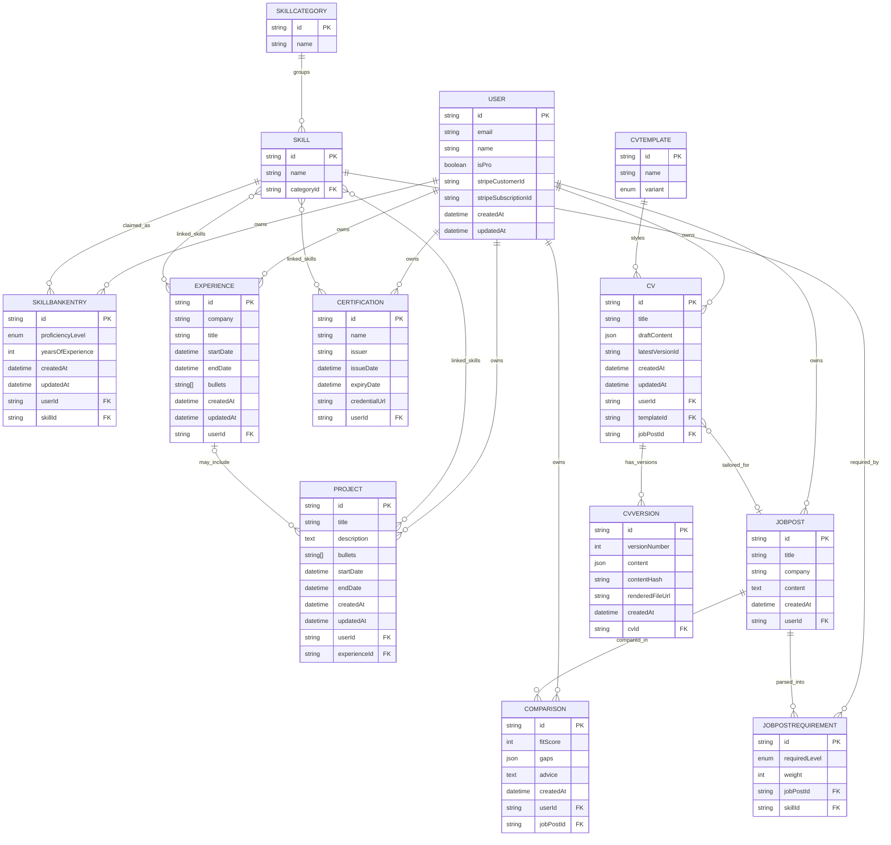
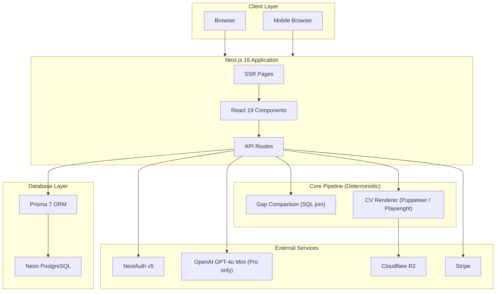
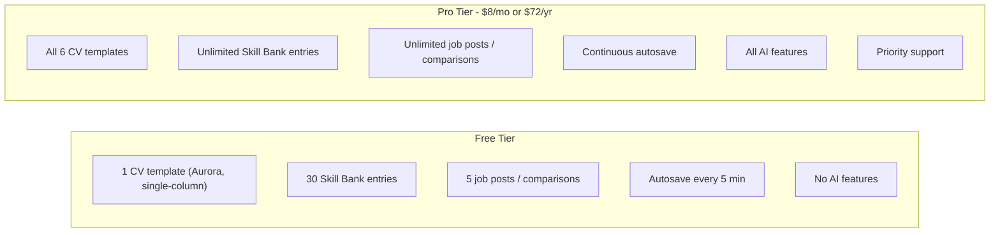

# DevPrep — Project Overview

> Match your background to any job post, generate tailored CVs, and close skill gaps — with a deterministic core pipeline and optional AI.

**Related docs:** [`architecture-notes.md`](./architecture-notes.md) — reasoning behind storage, versioning, and rendering decisions.

---

## 📋 Table of Contents

1. [Problem Statement](#-problem-statement)
2. [Target Users](#-target-users)
3. [Features](#-features)
4. [Data Architecture](#-data-architecture)
5. [Tech Stack](#-tech-stack)
6. [Monetization](#-monetization)
7. [UI/UX Guidelines](#-uiux-guidelines)
8. [Suggested Project Structure](#-suggested-project-structure)
9. [Next Steps](#-next-steps)

---

## 🎯 Problem Statement

Job-seeking developers apply to multiple roles without a concrete, low-cost way to see how their background actually matches each one:

| Pain Point                        | Today's Reality                                          |
| --------------------------------- | -------------------------------------------------------- |
| Prep & resume advice              | Generic, not tied to the actual posting                  |
| Missing skills for a role         | No quick way to see which ones matter for a specific job  |
| Tailoring a CV per application    | Manual, slow, and inconsistent                            |
| A growing career                  | Skills, experience, and certs pile up faster than recalled |
| Fixing what's wrong               | No feedback loop from "what the job asks" → "what to fix" |

**The Result:** Wasted effort, blind applications, and no prioritized path to close gaps.

**The Solution:** DevPrep maintains a growing **Skill Bank**, generates **tailored CVs** per job post, and runs a **deterministic** comparison to produce a quantified gap list, fit score, and rule-based advice. AI is layered on top as optional, bounded Pro features — never in the core path.

---

## 👥 Target Users

| User Type                          | Primary Needs                                                        |
| ---------------------------------- | ------------------------------------------------------------------- |
| 🔍 **Active Job Seeker**           | See fit per posting and prioritize which gaps matter most            |
| 🎓 **Career Switcher / Junior Dev** | A concrete list of what's missing and how to close it                |
| 😌 **Passive Candidate**           | Track fit across several postings before committing to a full apply  |

---

## ✨ Features

### A. Skill Bank

The persistent, structured store of a user's skills, experience, certifications, and projects — the single source of truth for everything else in DevPrep. Can be bootstrapped by importing an existing CV (parsed once into entries).

**Projects** are a peer to Experience, not a sub-item of it: personal projects, open-source contributions, freelance work, hackathons, or anything spanning multiple roles can be logged as a Project with its own description and linked skills, optionally tied to the Experience it happened during. A user can rely on Experience bullets alone and never touch Projects — Projects exist for finer-grained curation and for work that doesn't belong to a single job.

Skills belong to a **fixed taxonomy** (closed list per category) to keep gap matching exact and reliable:

| Category            | Icon            | Example Entries                              |
| ------------------- | --------------- | --------------------------------------------- |
| 🔷 Languages        | `Code2`         | JavaScript, TypeScript, Python, Go, SQL, Rust |
| 🟣 Frameworks       | `Boxes`         | React, Next.js, Django, Express, GraphQL      |
| 🟠 Tools            | `Wrench`        | Docker, Git, PostgreSQL, AWS, Kubernetes      |
| 🟡 Soft Skills      | `MessageSquare` | Communication, Leadership, Mentoring          |
| 🟢 Domain Knowledge | `BookOpen`      | REST API Design, Git & CI/CD, System Design   |

> **Note:** Category set is fixed (5). Entries per category are a seeded closed list (see [Seed Data](#seed-data-for-fixed-taxonomy--templates)).

### B. CVs

Generated from a user's **Experience and Project** entries — not the Skill Bank's proficiency ratings directly — each tailored to a specific job post. When creating a CV, candidate Experience/Project entries are ranked by how well their linked skills match the job post's requirements; the user picks which ones populate the draft. The Skill Bank itself stays focused on tracking proficiency and feeding the deterministic gap-analysis engine (see Feature D). Editable and versioned over time.

| Template   | Variants                          |
| ---------- | ---------------------------------- |
| 🔷 Aurora  | Single Column · Two Column         |
| 🟣 Slate   | Single Column · Two Column         |
| 🟠 Mono    | Single Column · Two Column         |

> **Note:** 3 designs × 2 variants = **6 layouts**. On Free, only Aurora (single-column) is available. Templates are structured so the system can populate them from Skill Bank data and re-derive structured data back out.

### C. Job Posts

- Added by **pasting the job description text** (URL scraping is out of scope for MVP).
- Unlimited posts (subject to plan limits).
- Stored with **structured requirement fields** (skills, seniority, tools) filled by the user or via simple rule/keyword matching — **no LLM dependency in the core path**.

### D. Comparison & Gap Analysis

- The **Skill Bank** (not a single static CV) is compared against each job post, so analysis always reflects the user's full background.
- **Deterministic**: set-diff / weighted scoring between Skill Bank fields and job post requirements (a real SQL join on `skillId`).
- Output per run: **fit score**, **gap list** (skill, required level, current level, severity), and **rule-based advice** on what to address first.

### E. CV Editing

- In-app editor to update a CV's fields directly, or apply suggested changes sourced from a comparison's gap list.
- **Accept/reject** suggestions; each accepted edit creates a **new CV version**.
- Edits stay **local to that CV** (no auto-sync back to the Skill Bank). Divergence surfaces a yellow **"stale"** indicator + tooltip; the user deliberately decides whether to update the Skill Bank. Toggleable.

### F. AI Features (Pro Only)

Optional add-ons — **not part of the core deterministic pipeline**.

- 🤖 Bullet rewriter (against a job post's language)
- 💡 Gap explainer (why a flagged gap matters)
- 📊 Score narrative (fit score → written summary)
- 📝 Job post summarizer
- ✉️ Cover letter generator
- 🏷️ Auto-tag job posts (role type / seniority)
- ❓ Interview question generator (per weak area)

---

## 🗄️ Data Architecture

### Entity Relationship Diagram



### Prisma Schema

> ⚠️ **Migrations only** — NEVER use `prisma db push` or directly update the database structure. See [Important Development Notes](#important-development-notes).

```prisma
// prisma/schema.prisma

generator client {
  provider = "prisma-client-js"
}

datasource db {
  provider = "postgresql"
  url      = env("DATABASE_URL")
}

// ============================================
// ENUMS
// ============================================
enum ProficiencyLevel {
  BEGINNER
  INTERMEDIATE
  ADVANCED
  EXPERT
}

enum TemplateVariant {
  SINGLE_COLUMN
  TWO_COLUMN
}

// ============================================
// USER
// ============================================
model User {
  id                   String    @id @default(cuid())
  email                String    @unique
  emailVerified        DateTime?
  name                 String?
  image                String?
  password             String?
  isPro                Boolean   @default(false)
  stripeCustomerId     String?   @unique
  stripeSubscriptionId String?   @unique
  createdAt            DateTime  @default(now())
  updatedAt            DateTime  @updatedAt

  // Relations
  skillBankEntries SkillBankEntry[]
  experiences      Experience[]
  certifications   Certification[]
  projects         Project[]
  cvs              CV[]
  jobPosts         JobPost[]
  comparisons      Comparison[]
  accounts         Account[]
  sessions         Session[]

  @@map("users")
}

// ============================================
// NEXTAUTH MODELS
// ============================================
model Account {
  id                String  @id @default(cuid())
  userId            String
  type              String
  provider          String
  providerAccountId String
  refresh_token     String? @db.Text
  access_token      String? @db.Text
  expires_at        Int?
  token_type        String?
  scope             String?
  id_token          String? @db.Text
  session_state     String?

  user User @relation(fields: [userId], references: [id], onDelete: Cascade)

  @@unique([provider, providerAccountId])
  @@map("accounts")
}

model Session {
  id           String   @id @default(cuid())
  sessionToken String   @unique
  userId       String
  expires      DateTime

  user User @relation(fields: [userId], references: [id], onDelete: Cascade)

  @@map("sessions")
}

model VerificationToken {
  identifier String
  token      String   @unique
  expires    DateTime

  @@unique([identifier, token])
  @@map("verification_tokens")
}

// ============================================
// FIXED TAXONOMY (system-seeded)
// ============================================
model SkillCategory {
  id     String  @id @default(cuid())
  name   String  @unique // Languages | Frameworks | Tools | Soft Skills | Domain Knowledge
  skills Skill[]

  @@map("skill_categories")
}

model Skill {
  id         String        @id @default(cuid())
  name       String
  categoryId String
  category   SkillCategory @relation(fields: [categoryId], references: [id])

  bankEntries     SkillBankEntry[]
  jobRequirements JobPostRequirement[]
  experiences     Experience[]         @relation("ExperienceSkills")
  certifications  Certification[]      @relation("CertificationSkills")
  projects        Project[]            @relation("ProjectSkills")

  @@unique([categoryId, name])
  @@index([categoryId])
  @@map("skills")
}

// ============================================
// SKILL BANK
// ============================================
model SkillBankEntry {
  id                String           @id @default(cuid())
  proficiencyLevel  ProficiencyLevel
  yearsOfExperience Int?
  createdAt         DateTime         @default(now())
  updatedAt         DateTime         @updatedAt

  userId  String
  user    User   @relation(fields: [userId], references: [id], onDelete: Cascade)
  skillId String
  skill   Skill  @relation(fields: [skillId], references: [id])

  @@unique([userId, skillId]) // one claim per skill per user
  @@index([userId])
  @@map("skill_bank_entries")
}

model Experience {
  id        String    @id @default(cuid())
  company   String
  title     String
  startDate DateTime
  endDate   DateTime? // null = current role
  bullets   String[]  // one or many accomplishment lines
  createdAt DateTime  @default(now())
  updatedAt DateTime  @updatedAt

  userId       String
  user         User      @relation(fields: [userId], references: [id], onDelete: Cascade)
  linkedSkills Skill[]   @relation("ExperienceSkills")
  projects     Project[] // projects that happened during this role (optional link)

  @@index([userId])
  @@map("experiences")
}

model Certification {
  id            String    @id @default(cuid())
  name          String
  issuer        String
  issueDate     DateTime
  expiryDate    DateTime?
  credentialUrl String?
  createdAt     DateTime  @default(now())
  updatedAt     DateTime  @updatedAt

  userId       String
  user         User    @relation(fields: [userId], references: [id], onDelete: Cascade)
  linkedSkills Skill[] @relation("CertificationSkills")

  @@index([userId])
  @@map("certifications")
}

// Peer to Experience, not a sub-item of it — covers personal/open-source/freelance/
// hackathon/multi-role work as well as finer-grained curation within a single job.
model Project {
  id          String    @id @default(cuid())
  title       String
  description String?   @db.Text
  bullets     String[]  // accomplishment lines, same shape as Experience.bullets
  startDate   DateTime?
  endDate     DateTime? // null = ongoing / no end date
  createdAt   DateTime  @default(now())
  updatedAt   DateTime  @updatedAt

  userId       String
  user         User        @relation(fields: [userId], references: [id], onDelete: Cascade)
  experienceId String?     // optional — set when this project happened during a specific role
  experience   Experience? @relation(fields: [experienceId], references: [id], onDelete: SetNull)
  linkedSkills Skill[]     @relation("ProjectSkills")

  @@index([userId])
  @@index([experienceId])
  @@map("projects")
}

// ============================================
// CVs
// ============================================
model CVTemplate {
  id      String          @id @default(cuid())
  name    String          // "Aurora" | "Slate" | "Mono"
  variant TemplateVariant
  cvs     CV[]

  @@unique([name, variant]) // 3 names × 2 variants = 6 rows
  @@map("cv_templates")
}

model CV {
  id              String  @id @default(cuid())
  title           String  // user label, e.g. "Backend Dev - Acme App"
  draftContent    Json    // live, mutable autosave working copy (not versioned itself)
  latestVersionId String? // denormalized pointer to newest CVVersion, for fast lookups
  createdAt       DateTime @default(now())
  updatedAt       DateTime @updatedAt

  userId     String
  user       User       @relation(fields: [userId], references: [id], onDelete: Cascade)
  templateId String
  template   CVTemplate @relation(fields: [templateId], references: [id])
  jobPostId  String?    // which post it was tailored for (optional)
  jobPost    JobPost?   @relation(fields: [jobPostId], references: [id])

  versions CVVersion[]

  @@index([userId])
  @@map("cvs")
}

// Immutable checkpoints — created only on manual Save.
model CVVersion {
  id              String  @id @default(cuid())
  versionNumber   Int
  content         Json    // snapshot at this version
  contentHash     String  // cheap diff-check before creating a new version
  renderedFileUrl String? // R2 URL — populated lazily on first export/download
  createdAt       DateTime @default(now())

  cvId String
  cv   CV     @relation(fields: [cvId], references: [id], onDelete: Cascade)

  @@unique([cvId, versionNumber])
  @@index([cvId])
  @@map("cv_versions")
}

// ============================================
// JOB POSTS & COMPARISON
// ============================================
model JobPost {
  id        String   @id @default(cuid())
  title     String
  company   String?
  content   String   @db.Text // raw pasted job description text
  createdAt DateTime @default(now())

  userId String
  user   User   @relation(fields: [userId], references: [id], onDelete: Cascade)

  requirements JobPostRequirement[]
  comparisons  Comparison[]
  cvs          CV[]

  @@index([userId])
  @@map("job_posts")
}

model JobPostRequirement {
  id            String           @id @default(cuid())
  requiredLevel ProficiencyLevel
  weight        Int? // importance, for weighted scoring (optional)

  jobPostId String
  jobPost   JobPost @relation(fields: [jobPostId], references: [id], onDelete: Cascade)
  skillId   String
  skill     Skill   @relation(fields: [skillId], references: [id])

  @@unique([jobPostId, skillId])
  @@index([jobPostId])
  @@map("job_post_requirements")
}

model Comparison {
  id        String   @id @default(cuid())
  fitScore  Int      // 0–100
  gaps      Json     // [{ skill, requiredLevel, currentLevel, severity }]
  advice    String   @db.Text // rule-based text generated from gaps
  createdAt DateTime @default(now())

  userId    String
  user      User    @relation(fields: [userId], references: [id], onDelete: Cascade)
  jobPostId String
  jobPost   JobPost @relation(fields: [jobPostId], references: [id], onDelete: Cascade)

  @@index([userId])
  @@index([jobPostId])
  @@map("comparisons")
}
```

### Seed Data (Fixed Taxonomy & Templates)

```typescript
// prisma/seed.ts

import { PrismaClient } from '@prisma/client';

const prisma = new PrismaClient();

// 5 fixed categories, each with a closed list of skills (sample shown — finalize before launch)
const skillTaxonomy: Record<string, string[]> = {
  'Languages': ['JavaScript', 'TypeScript', 'Python', 'SQL', 'Go', 'Rust'],
  'Frameworks': ['React', 'Next.js', 'Node.js', 'Django', 'Express', 'GraphQL'],
  'Tools': ['Docker', 'Git', 'PostgreSQL', 'AWS', 'Redis', 'Terraform', 'Celery', 'Linux', 'Kubernetes'],
  'Soft Skills': ['Communication', 'Leadership', 'Mentoring', 'Collaboration'],
  'Domain Knowledge': ['REST API Design', 'Git & CI/CD', 'System Design'],
};

// 3 templates × 2 variants = 6 rows
const cvTemplates = [
  { name: 'Aurora', variant: 'SINGLE_COLUMN' },
  { name: 'Aurora', variant: 'TWO_COLUMN' },
  { name: 'Slate', variant: 'SINGLE_COLUMN' },
  { name: 'Slate', variant: 'TWO_COLUMN' },
  { name: 'Mono', variant: 'SINGLE_COLUMN' },
  { name: 'Mono', variant: 'TWO_COLUMN' },
] as const;

async function main() {
  console.log('Seeding fixed taxonomy...');

  for (const [categoryName, skills] of Object.entries(skillTaxonomy)) {
    const category = await prisma.skillCategory.upsert({
      where: { name: categoryName },
      update: {},
      create: { name: categoryName },
    });

    for (const skillName of skills) {
      await prisma.skill.upsert({
        where: { categoryId_name: { categoryId: category.id, name: skillName } },
        update: {},
        create: { name: skillName, categoryId: category.id },
      });
    }
  }

  console.log('Seeding CV templates...');

  for (const template of cvTemplates) {
    await prisma.cVTemplate.upsert({
      where: { name_variant: { name: template.name, variant: template.variant } },
      update: {},
      create: template,
    });
  }

  console.log('Seeding complete!');
}

main()
  .catch((e) => {
    console.error(e);
    process.exit(1);
  })
  .finally(async () => {
    await prisma.$disconnect();
  });
```

---

## 🛠️ Tech Stack

### Architecture Diagram



### Technology Choices

Reused directly from **DevStash** — same stack, same course tooling, no new infra to learn (except CV rendering).

| Category           | Technology                     | Notes                                                        |
| ------------------ | ------------------------------ | ------------------------------------------------------------ |
| **Framework**      | Next.js 16 / React 19          | SSR pages, API routes, single codebase                       |
| **Language**       | TypeScript                     | Type safety throughout                                       |
| **Database**       | Neon PostgreSQL                | Serverless Postgres                                          |
| **ORM**            | Prisma 7                       | Migrations only — never `db push`                            |
| **File Storage**   | Cloudflare R2                  | Lazily-rendered CV exports (per `CVVersion`, not per `CV`)   |
| **Authentication** | NextAuth v5                    | Email/password + GitHub + Google OAuth                       |
| **AI**             | OpenAI GPT-4o Mini             | **Responses API** (not Chat Completions); Pro features only  |
| **Styling**        | Tailwind CSS v4 + shadcn/ui    | Modern, accessible components                                |
| **Payments**       | Stripe                         | Subscriptions & billing                                      |
| **CV Rendering**   | Puppeteer / Playwright         | 🆕 DevPrep-specific — renders `content` JSON to PDF/DOC       |

### Important Development Notes

> ⚠️ **Database Migrations**
>
> **NEVER** use `prisma db push` or directly update the database structure.
>
> Always create migrations that run in development first, then production:
>
> ```bash
> # Create migration
> npx prisma migrate dev --name <migration_name>
>
> # Apply to production
> npx prisma migrate deploy
> ```

> 🚧 **Pro Gating:** Set up the foundation for Pro users, but during development **all users can access everything**. Gating will be enabled before launch.

### Recommended Links

- [Next.js Documentation](https://nextjs.org/docs)
- [Prisma Documentation](https://www.prisma.io/docs)
- [NextAuth.js Documentation](https://authjs.dev)
- [Tailwind CSS v4](https://tailwindcss.com/docs)
- [shadcn/ui Components](https://ui.shadcn.com)
- [Neon PostgreSQL](https://neon.tech/docs)
- [Cloudflare R2](https://developers.cloudflare.com/r2)
- [Stripe Subscriptions](https://stripe.com/docs/billing/subscriptions)
- [Puppeteer](https://pptr.dev) · [Playwright](https://playwright.dev)

---

## 💰 Monetization

### Pricing Tiers



### Feature Comparison

| Feature                       |    Free     |     Pro     |
| ----------------------------- | :---------: | :---------: |
| CV templates                  | 1 (Aurora)  |  All 6      |
| Skill Bank entries            |     30      | Unlimited   |
| Job posts / comparisons       |      5      | Unlimited   |
| Autosave cadence              |  Every 5 min | Continuous  |
| Manual Save                   |     ✅      |     ✅      |
| Deterministic gap analysis    |     ✅      |     ✅      |
| AI features (all 7)           |     ❌      |     ✅      |
| Priority support              |     ❌      |     ✅      |

> ¹ Price ($8/mo · $72/yr) is a placeholder mirroring DevStash's point — not market-researched.
>
> **Development Note:** During development, all users can access all features. Pro gating will be enabled before launch.

---

## 🎨 UI/UX Guidelines

### Design Principles

- **Clean & Professional** — this produces a document sent to employers; it must read as credible, not gimmicky
- **Dark Mode Default (app)** — exported CVs always render in print-friendly light styling, regardless of app theme
- **Clean Typography** — generous whitespace
- **Separate Concerns** — product UI and document design are distinct
- **Report-style Results** — fit score, gap list, and advice as a readable report

### Design References

- [Notion](https://notion.so) — Clean organization
- [Linear](https://linear.app) — Modern dev aesthetic

### Layout Structure

```
┌─────────────────────────────────────────────────────────────┐
│  DevPrep                                     🔍  ⚙️  👤     │
├──────────────┬──────────────────────────────────────────────┤
│              │                                              │
│  SKILL BANK  │  Recent Comparisons                          │
│  ─────────   │  ┌────────┐ ┌────────┐ ┌────────┐           │
│  Languages   │  │ Acme   │ │ Globex │ │ Initech│           │
│  Frameworks  │  │ 82%    │ │ 64%    │ │ 91%    │           │
│  Tools       │  └────────┘ └────────┘ └────────┘           │
│  Soft Skills │                                              │
│  Domain      │  My CVs                                      │
│  ─────────   │  ┌──────────────────────────────────────┐   │
│  JOB POSTS   │  │ Backend Dev - Acme App        v3     │   │
│  Acme App    │  ├──────────────────────────────────────┤   │
│  Globex API  │  │ Frontend - Globex             v1     │   │
│  ─────────   │  ├──────────────────────────────────────┤   │
│  CVs         │  │ Full-Stack - Initech          v5     │   │
│  Backend...  │  └──────────────────────────────────────┘   │
│              │                                              │
└──────────────┴──────────────────────────────────────────────┘
```

### Gap Severity Colors (CSS Variables)

```css
:root {
  --color-gap-missing: #ef4444; /* Red    — skill absent */
  --color-gap-below:   #f59e0b; /* Amber  — below required level */
  --color-gap-met:     #10b981; /* Green  — requirement met */
  --color-stale:       #eab308; /* Yellow — CV diverges from Skill Bank */
}
```

### Icon Mapping (Lucide React)

```typescript
// lib/constants/skill-categories.ts

import { Code2, Boxes, Wrench, MessageSquare, BookOpen } from 'lucide-react';

export const SKILL_CATEGORY_ICONS = {
  'Languages': Code2,
  'Frameworks': Boxes,
  'Tools': Wrench,
  'Soft Skills': MessageSquare,
  'Domain Knowledge': BookOpen,
} as const;

export const GAP_SEVERITY_COLORS = {
  missing: '#ef4444',
  below: '#f59e0b',
  met: '#10b981',
  stale: '#eab308',
} as const;
```

### Responsive Behavior

| Viewport            | Sidebar                    | Layout                            |
| ------------------- | -------------------------- | --------------------------------- |
| Desktop (≥1024px)   | Visible, collapsible       | Full sidebar + main content       |
| Tablet (768-1023px) | Drawer (hidden by default) | Full-width main content           |
| Mobile (<768px)     | Drawer (hidden by default) | Stacked cards; CV editor is full-screen |

### Micro-interactions

- **Transitions** — Smooth 150–200ms easing
- **Toast Notifications** — For saves and comparison runs
- **Loading States** — Skeleton placeholders
- **CV Editor** — Opens in a dedicated full editor (not a quick drawer)
- **Stale Indicator** — Yellow marker + tooltip when a CV diverges from the Skill Bank; toggleable

---

## 📁 Suggested Project Structure

```
devprep/
├── prisma/
│   ├── schema.prisma
│   ├── migrations/
│   └── seed.ts
├── src/
│   ├── app/
│   │   ├── (auth)/
│   │   │   ├── login/
│   │   │   └── register/
│   │   ├── (dashboard)/
│   │   │   ├── skill-bank/
│   │   │   │   └── [category]/
│   │   │   ├── experience/
│   │   │   ├── projects/
│   │   │   ├── job-posts/
│   │   │   │   └── [id]/
│   │   │   ├── cvs/
│   │   │   │   └── [id]/edit/
│   │   │   ├── comparisons/
│   │   │   │   └── [id]/
│   │   │   └── settings/
│   │   ├── api/
│   │   │   ├── skill-bank/
│   │   │   ├── experience/
│   │   │   ├── projects/
│   │   │   ├── job-posts/
│   │   │   ├── cvs/
│   │   │   ├── comparisons/
│   │   │   ├── ai/
│   │   │   ├── render/          # CV → PDF/DOC
│   │   │   └── webhooks/stripe/
│   │   ├── layout.tsx
│   │   └── page.tsx
│   ├── components/
│   │   ├── ui/                  # shadcn components
│   │   ├── skill-bank/
│   │   ├── cvs/
│   │   ├── job-posts/
│   │   ├── comparisons/
│   │   ├── layout/
│   │   └── shared/
│   ├── lib/
│   │   ├── prisma.ts
│   │   ├── auth.ts
│   │   ├── stripe.ts
│   │   ├── openai.ts
│   │   ├── r2.ts
│   │   ├── comparison/          # deterministic gap engine
│   │   ├── render/              # CV rendering
│   │   └── constants/
│   ├── hooks/
│   ├── types/
│   └── styles/
│       └── globals.css
├── public/
├── .env.example
├── next.config.ts
├── tsconfig.json
└── package.json
```

---

## 🚀 Next Steps

1. [X] Initialize Next.js 16 project with TypeScript
2. [X] Set up Prisma with Neon PostgreSQL
3. [X] Create database migrations for initial schema
4. [X] Build core UI components with shadcn/ui
5. [X] Seed fixed taxonomy (categories + skills) and CV templates
6. [ ] Configure NextAuth v5 (email + GitHub + Google)
7. [X] Implement Skill Bank CRUD (skills, experience, certifications, projects)
8. [X] Implement Job Posts CRUD (paste + structured requirements)
9. [ ] Build the deterministic comparison / gap engine
10. [ ] Implement CVs: generation (curated from Experience/Project entries, ranked by skill-match against the job post), editor, autosave, versioning
11. [ ] Set up Cloudflare R2 + CV PDF/DOC rendering (lazy per version)
12. [ ] Integrate Stripe for subscriptions
13. [ ] Add AI features (OpenAI Responses API, Pro only)
14. [ ] Implement usage limits for the free tier
15. [ ] Testing & polish
16. [ ] Deploy to production

---

_Last updated: July 2026_
